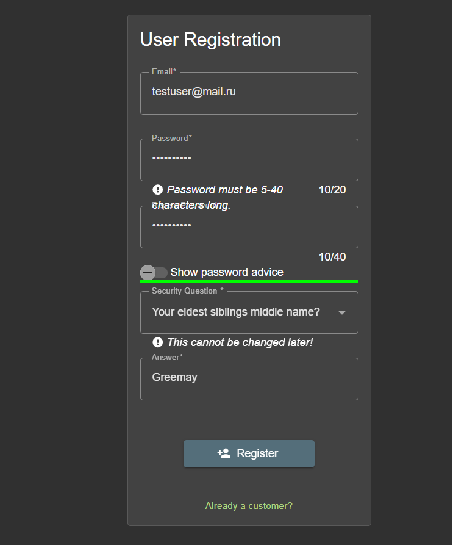
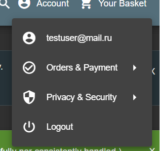

## ✅ Положительный сценарий: Успешная регистрация нового пользователя

### 📌 Описание
Проверка корректной работы формы регистрации при валидных данных. Успешная регистрация подтверждается входом в систему.

### 📍 Шаги:
1. Перейти на страницу регистрации OWASP Juice Shop.
2. Ввести email: `newuser@juice.local`
3. Ввести пароль: `Test123!`
4. Повторить пароль: `Test123!`
5. Выбрать секретный вопрос.
6. Ввести ответ на секретный вопрос.
7. Нажать кнопку **Register**.

### ✅ Ожидаемый результат:
- Пользователь успешно регистрируется.
- Сразу после регистрации происходит вход в систему и переход на домашнюю страницу.

### 🖼️ Скриншоты:

---

### 📦 Среда
- Приложение: OWASP Juice Shop
- Версия: последняя (Docker)
- Браузер: Chrome 125.0.x
- ОС: Ubuntu 22.04
