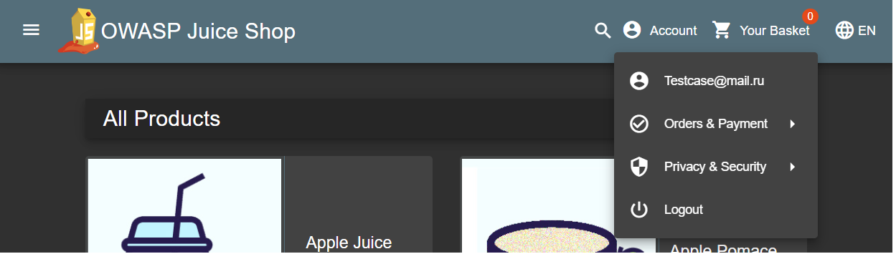
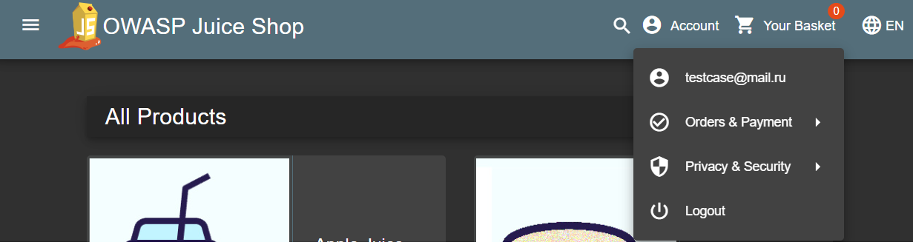

## 🐞 Баг: Регистрация разрешена с email в разном регистре

### 📌 Описание
Система позволяет зарегистрировать двух пользователей с одинаковыми email-адресами, различающимися только регистром символов. Это может привести к путанице, дублированию аккаунтов и потенциальным уязвимостям (например, в восстановлении пароля).

### 📍 Шаги для воспроизведения:
1. Перейти на страницу регистрации.
2. Зарегистрировать пользователя с email: `TestUser@juice.local`, указав валидный пароль и секретный вопрос.
3. Выйти из аккаунта.
4. Повторно пройти регистрацию с email: `testuser@juice.local`.
5. Убедиться, что система разрешает повторную регистрацию.

### ✅ Ожидаемый результат:
Система должна выдавать сообщение: `Email already exists`, игнорируя регистр символов.

### ❌ Фактический результат:
Система успешно регистрирует нового пользователя с тем же email, но в другом регистре.

### 💡 Дополнительная информация:
- Email по стандарту RFC 5321 **не должен** учитывать регистр локальной части.
- Подобное поведение может:
  - вызвать дублирование аккаунтов,
  - нарушить логику восстановления пароля,
  - привести к неочевидным ошибкам в работе почтовых сервисов.

### 🖼️ Скриншоты:

---

### 📦 Среда
- Приложение: OWASP Juice Shop
- Версия: последняя (запущена через Docker)
- Браузер: Chrome 125.0.x
- ОС: Ubuntu 22.04
